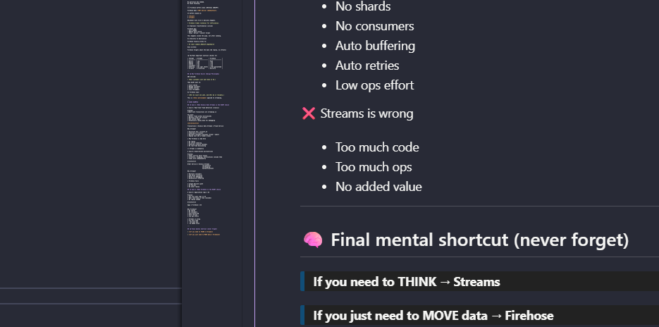

# Amazon Kinesis Firehose

Kinesis Firehose is a managed delivery pipe — not a stream, not a log, not replayable.

Firehose is closer to:

**“A continuously running COPY INTO S3”**:
- No shards
- No partitions
- No offsets
- No replay
- No consumers

Just:ingest → buffer → deliver

--

## 🧠 Firehose Mental Picture (Physical Analogy)

Imagine:

* A **water pipe**
* Water flows continuously
* Pipe **temporarily holds water**
* Periodically dumps water into a **tank (S3)**

Once dumped:

* Water is gone from the pipe
* You cannot ask “give me old water again”

That’s Firehose.

---

## 🏗️ What Firehose Actually Manages For You

Firehose hides all complexity that Streams exposes.

You do NOT manage:

Shards,Throughput units,Consumer scaling,Ordering guarantees

AWS says:

`“Give me data. I’ll land it safely.”`

## 🔄 Firehose Data Flow (Step-by-Step)

Let’s run the lifecycle calmly.

#### 1️⃣ Producer sends records

* HTTP / SDK / agent
* JSON / logs / metrics

No partition key needed.
No shard thinking.

---
2️⃣ Firehose buffers data (CRITICAL CONCEPT)

Firehose does **NOT deliver immediately**.

It buffers based on:

* **Size**
* **Time**

Whichever hits first → delivery happens.

> Firehose trades *latency* for *efficiency*.

3️⃣ Optional transformation (inline)

Firehose may:
- Call Lambda
- Modify each record
- Drop / enrich / convert format

This happens inside the pipe, not after landing.

4️⃣ Delivery to destination

Firehose finally writes to:

> S3 (most common),Redshift,OpenSearch

Once written:

Firehose forgets about the data (No replay, no offsets)

---

🧠 The Most Important Contrast (Anchor It)

| Concept   | Streams         | Firehose         |
| --------- | --------------- | ---------------- |
| Nature    | Log             | Pipe             |
| Replay    | Yes             | ❌ No             |
| Shards    | Yes             | ❌ No             |
| Consumers | Yes             | ❌ No             |
| Ordering  | Yes (per shard) | ❌ Not guaranteed |
| Purpose   | Processing      | Delivery         |

---

## 🧠 Why Firehose Exists (Design Philosophy)

AWS noticed:

> “Most customers just want data in S3.”

They don’t want to:

* Scale shards
* Manage consumers
* Handle retries
* Tune throughput

So Firehose says:

> “I’ll do *just one job*, and I’ll do it reliably.”

This is **Unix philosophy** applied to streaming.

---
# CASES EXAMPLE

## 🔵 Case 1: When Kinesis Data Streams is the RIGHT choice

✅ Case A: Real-time fraud detection (classic)

Problem:
Credit-card transactions are streaming in

You must:
* Detect fraud within milliseconds
* Maintain order per account
* Run custom logic
* Potentially replay data for debugging

**Architecutre**
```
Transactions → Kinesis Data Streams → Fraud Service
```
Why Streams?

* Partition key = account_id
* Ordering is critical
* Multiple consumers possible (fraud + audit)
* Replay last 24h if model breaks

❌ Why Firehose is bad here

* No replay
* No strict ordering
* Buffered (latency seconds)
* No real-time decisioning

👉 Streams is mandatory

✅ Case B: Event-driven microservices

Problem: 
* Order service emits events
* Inventory, shipping, notifications consume them
* Teams work independently

Architecture
```
Order Service → Kinesis Streams
                     ├─ Inventory
                     ├─ Shipping
                     └─ Notifications
```
Why Streams?

* Multiple consumers
* EFO gives isolation
* Relay for debugging
* Backpressure handling

❌ Firehose fails

* Single delivery path
* No fan-out
* No event replay

## 🟢 Case 2: When Firehose is the RIGHT choice

✅ Case D: Application logs → S3

Problem
* You just want logs in S3
* Near real-time is fine (seconds)
* No replay needed

Architecture
```
Apps → Firehose → S3
```

Why Firehose?
* No shards
* No consumers
* Auto buffering
* Auto retries
* Low ops effort

❌ Streams is wrong
* Too much code
*  Too much ops
*  No added value

---

## 🧠 Final mental shortcut (never forget)

> **If you need to THINK → Streams**

> **If you just need to MOVE data → Firehose**


